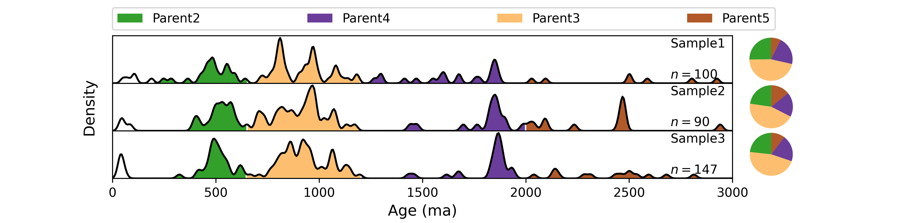

# detritalKDE
Calculates kernel density (KD) and KD - based mass balance and plots empirical pdf and pie plots for multiple detrital samples.

  <b>Help files and demo data will be uploaded soon...</b>

